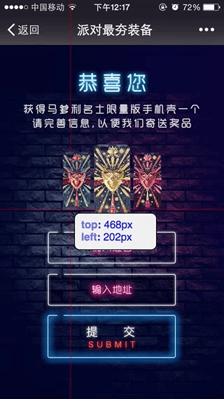
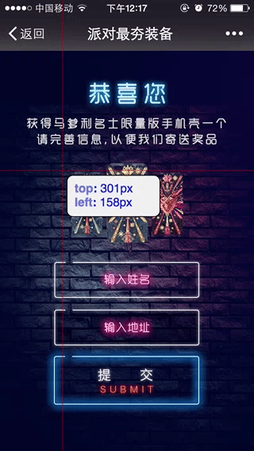

## measure.js

代码中只针对了主流的 *iPhone 5* 和 *iPhone 6* 尺寸。

在公司闲的无聊，所以想来写一个测量单位的插件，写完之后突然发现这个插件其实也是挺无聊的，估计也就对我自己有用一点吧，有需要的童鞋也是可以来试玩一下的。

插件可以用于测量 *rem* 和 *px* 两个不同单位。

### *rem* 单位长度测量

一般设计出设计稿会有 `320` 和 `375` 的尺寸，其实对应的就是 *iPhone 5* 和 *iPhone 6* 下的尺寸。

如果我们需要用 *rem* 来进行自适应的话，一般需要引用 [*rem.js*](assets/scripts/rem.js) ，写成 *rem* 单位的时候需要除以 `100`，也就是说：

> 438px => 4.38rem

所以全部以我使用的为准吧，感觉有点强盗行为。

这时候出现小数点的单位在浏览器里需要定位调试的话会比较麻烦，尽管浏览器里可以进行整数的和一位小数点的单位快捷键控制，貌似不能进行第三位小数点的单位控制，所以不断控制调整单位总比一次到位来的麻烦，这个插件很方便。

### *px* 单位长度测量

这个不具体细说了，测量和 *rem* 是一样的，只是显示的单位和数值不一样。

### 用法

#### 1. 得到设计稿尺寸

一般设计稿出的 *iPhone 5* 尺寸为 `640 * 1136`，而 *iPhone 6* 尺寸为 `750 * 1334`，真正的尺寸还需要去掉微信自带的一个导航栏刚好为 `128px`。如果你测量的不是微信的设计稿，就不需要去掉导航栏。

#### 2. 基本结构

引入一下我的小小 `CSS` 文件：

```html
<link rel="stylesheet" href="dist/measure.css">
```

根据设计稿的大小在浏览器里模拟对应的手机型号，直接将整图放入：

```html
<div class="container">
	
</div>
```

之后引入我们的插件：

```html
<script type="text/javascript" src="dist/remeasure.min.js"></script>
```

####  3. 初始化到完成

参数说明：

|    参数    |    类型    |      举🌰       |    说明     |
| :------: | :------: | :------------: | :-------: |
|  target  | `String` | `'.container'` |  `目标容器`   |
|   size   | `Number` |     `640`      |  `设计稿尺寸`  |
| isNavbar | `Boolen` |     `true`     |  `是否有微信`  |
|   unit   | `String` |     `rem`      | `指定测量的单位` |

现在我们可以在页面中这么写：

```javascript
var iPhone = new Measure({
	// target element
	target: '.container',

	// have wechat navbar
	isNavbar: true,

	// setup phone size
	// iPhone 5 screen width is 640, iPhone 6 screen width is 750
	size: 750,

	// specify the unit you want to measure
	// default unit
	unit: 'px'

});
			
iPhone.measure();
```

在浏览器里打开开发者工具，并选择对应的手机型号：


在浏览器里我们可以鼠标点击操作：



也可以键盘操作，控制键可以是 ⬆️ ⬇️ ⬆️ ➡️，也可以是 `w`， `a`， `s`， `d`，主要是增加测量的准确性：



最后我们在 `Console` 里面复制我们测量的结果。

### 写在结尾的话

具体的代码可以去参见 [demo](demo/index.html)。

可能在工作中用 *rem* 的时候对于位置的瞄准能节省一点点时间吧。

之后的小红点会改成十字，更便于测量。

我又在想如果设计稿有很多趴，我的步骤也多，这样做可能还是有点累的吧😂